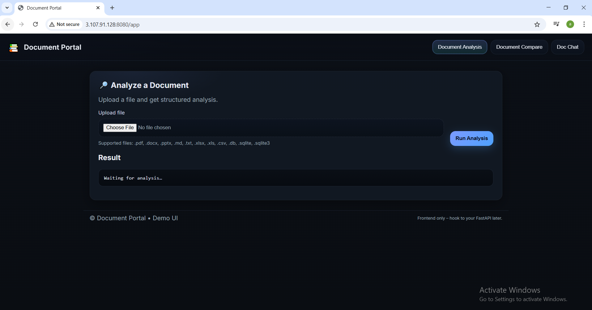
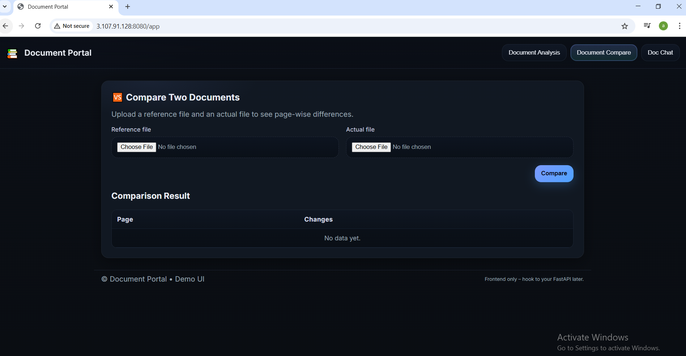
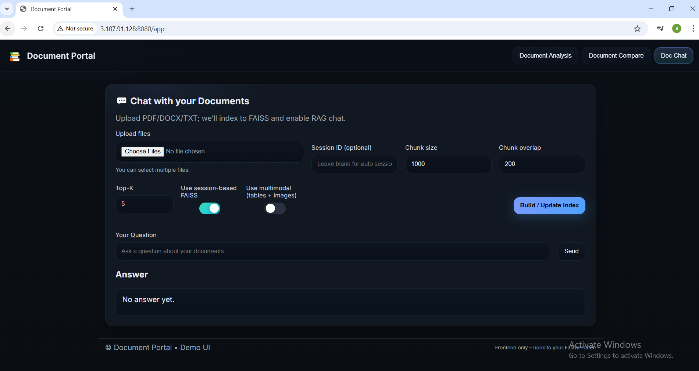

# Document Portal Analysis with RAG

## Business Use Case

In a company, when purchasing products from a third-party vendor, the vendor often provides invoices or reports related to electronic devices from various chip makers worldwide. Instead of manually reviewing these invoices or reports, we need a streamlined solution for analyzing and comparing them. The **Document Portal Analysis** application aims to build a portal that allows for comparison, analysis, and interactive communication with these documents.

### Features

a. Created login/signup credentials.
b. The services below will only appear if the user provides valid login credentials..

The application provides four core services for document management:

1. **Document Analysis**  
   This service analyzes any document (e.g., PDFs) uploaded by the user. Upon uploading, the system performs a detailed analysis of the document's contents, providing insights and relevant information.

    

2. **Document Compare**  
   Users can upload two different PDFs, and the system will compare them side-by-side, highlighting the differences. This service is useful for tracking variations in invoices or reports from multiple vendors.

   

3. **Single Document Chat**  
   This feature allows users to interact with a single document by uploading a PDF and asking questions related to its content. The system will provide relevant responses based on the document's text.

    

4. **Multi-Document Chat**  
   Users can upload multiple PDFs and interact with them simultaneously. This service enables querying across multiple documents, offering a holistic view of the provided data.

    

## Technologies Used
- Python
- Langchain
- FastAPI
- Streamlit
- Google Embeddings Model
- FAISS
- Groq LLM Models
- Google Gemini LLM Model
- Docker
- CI/CD Pipeline with Github Actions
- AWS (ECR, Fargate, ECS, Secret Manager)

## Installation

1. **Clone the repository**:

   git clone https://github.com/Anuragreddy-Naredla/document_portal_analysis_with_adv_RAG.git

2. **Create the virtual environment**:

    conda create -p env python=3.10 -y

3. **Activate the virtual environment**:

    conda activate env

4. **Install the required dependencies**:

    pip install -r requirements.txt

**Generate API Keys**

1. **Create a .env file** in your current folder.

2. **Groq API Key:**

    * Go to the Groq Console(https://console.groq.com/keys)

    * Go to the API Keys tab.

    * Click on "Create API Key" and copy the key.

    * Paste the key in the .env file:
        GROQ_API_KEY="YOUR_API_KEY_HERE"
3. **Google API Key:**
    * Go to Google AI Studio(https://aistudio.google.com/prompts/new_chat)
    * Create an API key.
    * Paste the key in the .env file:
        GOOGLE_API_KEY="YOUR_API_KEY_HERE"

**Deployment Steps**
**Configure AWS Services**

1. **Configure ECR (Elastic Container Registry):**

    * Search for "ECR" and click on "Elastic Container Registry".

    * Select the region (e.g., ap-southeast-2).

    * Click on "Create Repository".

    * Name the repository (e.g., documentportalsystem), matching the name in the aws.yaml file under ECR_REPOSITORY.

    * Enable "Scan on push" under Image Scanning Settings.

    * Copy the "URI" and save it for later.

2. **Configure IAM User:**

    * Search for "ECR" and click on "Elastic Container Registry".
    * Go to the "IAM" service, then click on "Users" under "Access Management".

    * Click on "Create user", assign a name, and attach the following policies:

        * AmazonEC2ContainerRegistryFullAccess

        * AmazonECS_FullAccess

        * AmazonS3FullAccess

        * SecretsManagerReadWrite

        * CloudWatchLogsFullAccess

    * Copy the "ARN" under "Summary" after creating the user.

    * Create access keys for CLI access. Store the "Access key" and "Secret access key" securely.

    * Add these credentials to GitHub Secrets for CI/CD integration:

        * AWS_ACCESS_KEY_ID

        * AWS_SECRET_ACCESS_KEY

3. **Configure ECS (Elastic Container Service):**

    * Search for ECS and click on "Create Cluster".

    * Use the cluster name from the aws.yaml file.

    * Choose "AWS Fargate (serverless)" for the launch type.

    * Create the task definition and configure with the task_definition.json file.

    * Deploy the task.

4. **Configure AWS Secret Manager:**

    * Search for "Secret Manager" and click on "Store a new secret".

    * Add the following keys:

        * GROQ_API_KEY

        * GOOGLE_API_KEY

    * Store the secret.

5. **Execute the Application:**

    * Run the application at least once to generate the ecsTaskExecutionRole.

    * Add the required policies (from incline_policy.json) to the IAM role for access.

6. **Security Groups and Secret Manager:**

    * Set up security groups from EC2.

    * Update the task_definition.json with the secret values in SECRET MANAGER:

        "Secrets": [
                {
                    "Name": "GROQ_API_KEY",
                    "ValueFrom": "YOUR_SECRET_MANAGER_KEY"
                },
                {
                    "Name": "GOOGLE_API_KEY",
                    "ValueFrom": "YOUR_SECRET_MANAGER_KEY"
                }
                ]

**Accessing the Application**

    1. Go to the ECS service and open the cluster.

    2. Go to "Tasks" and click on the most recent task.

    3. Under "Configuration", copy the "Public IP".

    4. Open a browser and navigate to http://<Public_IP>:8080.

**Cleanup**
 * After completing the project, delete the AWS services (ECR, ECS) to avoid ongoing charges.

 **Steps to Create a Docker Image Locally in Docker Desktop App:**

 **1. Build the Docker image:**

 * Run the following command in the CMD (Command Prompt):
    
    * docker build -t document-portal-system-with-rag .

        * -t: This flag specifies the tag for the image.

        * .: Refers to the directory where the Dockerfile is located.

        * document-portal-system-with-rag: This is the name you want to assign to the Docker image.

**2. List all Docker images:**

    * To view all the images you have built on Docker, run:
        * docker images

**3. Run the Docker container:**

    * Start the container with the following command:

        * docker run -d -p 8093:8080 --name doc-portal-app document-portal-system-with-rag

            * -d: Runs the container in detached mode, meaning it will run in the background.

            * -p: Publish the container’s port.

            * 8093: The port on your local system.

            * 8080: The port inside the container.

            * --name doc-portal-app: This is the name of your container.

            * document-portal-system-with-rag: The image name to create the container from.

**4. Check the app in the browser:**

    * To verify that the container is running, open a browser and navigate to:
        * http://localhost:8093/

* **.github/workflows Overview**

    The .github/workflows folder contains the following three files:
        1. aws.yaml
        2. ci.yaml
        3. task_definition.json

    **What the aws.yaml File Does**
        **CI/CD Pipeline: CI/CD to ECS Fargate**
        **Workflow Overview:**
            **1. Trigger:**
                * The pipeline is triggered when the **"Run Unit Tests"** workflow completes successfully on the **master branch.**.
            **2. Build & Push Docker Image:**
                * The Docker image is built using the application’s **Dockerfile**.
                * The image is tagged with the current Git commit hash and pushed to the **Amazon Elastic Container Registry (ECR)**.
            **3. Deploy to ECS Fargate:**
                * The pipeline deploys the newly built Docker image to an **Amazon ECS Fargate** service.
                * The ECS task definition is updated with the new image, and the ECS service is redeployed.
        **Key Steps in the Pipeline:**
        * **Check Status**: Ensures the CI workflow passed successfully and is from the **master** branch before proceeding.
        **Build and Push Docker Image:**
            * Logs in to **ECR** and builds the Docker image.
            * Pushes the image to the ECR repository.
        **Render and Deploy Task Definition:**
            * Renders an updated ECS task definition with the new Docker image.
            * Deploys the task definition to **ECS Fargate**, ensuring the service is stable post-deployment.
        **Environment Variables:**
            * **AWS_REGION:** AWS region for ECS.
            * **ECR_REPOSITORY:** ECR repository name.
            * **ECS_SERVICE:** ECS service name to update.
            * **ECS_CLUSTER:** ECS cluster to deploy to.
            * **ECS_TASK_DEFINITION:** Path to the ECS task definition file.
            * **CONTAINER_NAME:** Name of the container within the ECS task.
        **Prerequisites:**
            * AWS credentials stored in GitHub Secrets (AWS_ACCESS_KEY_ID, AWS_SECRET_ACCESS_KEY).
            * Valid ECR repository for storing Docker images.
            * ECS Cluster and Service set up to deploy the Docker containers.
        **How to Trigger the Pipeline:**
            * Push changes to the master branch.
            * Ensure that unit tests are configured in the "Run Unit Tests" workflow, as the CI/CD pipeline will be triggered once those tests are completed successfully.
    
    **What the ci.yaml File Does**
        **CI Workflow: Run Unit Tests**
            * The **CI workflow** (ci.yml) automates the process of running unit tests using GitHub Actions. It ensures that all code changes are tested before merging or pushing to the repository.
        **Workflow Overview:**
            **1. Trigger:**
                * This workflow runs on push and pull_request events, meaning it will trigger whenever code is pushed to the repository or when a pull request is created or updated.
            **2. Steps in the Workflow:**
                * **Checkout Repository:** The workflow first checks out the code from the repository using the actions/checkout action.
                * **Set Up Python:** It sets up the environment to use Python version 3.10 with actions/setup-python.
                * **Install Dependencies:** The necessary Python dependencies are installed:
                    * Upgrades pip to the latest version.
                    * Installs the packages listed in requirements.txt.
                    * Installs pytest to run the unit tests.
                * **Run Unit Tests:** It runs the unit tests located in the tests/ directory using pytest
        **Purpose:**
            * This workflow ensures that all tests pass automatically whenever new changes are pushed to the repository or a pull request is made. This helps maintain code quality and catch issues early in the development process.
    
    **What the task_definition.json File Does**
        **ECS Task Definition: documentportaltd**
            * This ECS Task Definition is used to run a containerized application on Amazon ECS Fargate.
        **Key Components:**
            **1. Family:**
                * The task is part of the documentportaltd family, which is used for organizing task definitions.
            **2.Network Mode:**
                * The task uses the awsvpc network mode, which means each task gets its own ENI (Elastic Network Interface) and IP address.
            **3. Execution Role:**
                * The task uses an IAM role (ecsTaskExecutionRole) to interact with other AWS services such as ECR, CloudWatch Logs, and Secrets Manager.
            **4. Compatibilities:**
                * The task is compatible with FARGATE, meaning it will run on AWS Fargate (serverless compute).
            **5. Resources:**
                CPU: 1024 CPU units (1 vCPU).
                Memory: 8192 MiB (8 GB) of RAM allocated for the task.
            **6. Container Definitions:**
                * The container definition specifies a single container:
                    * **Name:** document-portal-container
                    * **Image:** The container image is pulled from ECR using the repository documentportalsystem in the region ap-southeast-2.
                    * **Port Mapping:**
                        * The container exposes port 8080 for HTTP traffic.
                    **Environment Variables:**
                        * The ENV environment variable is set to production.
                    **Secrets:**
                        * API_KEYS are fetched securely from AWS Secrets Manager using the ARN provided.
                    **Logging:**
                        * Logs are sent to AWS CloudWatch Logs with the group /ecs/documentportaltd in the ap-southeast-2 region. The logs are prefixed with "ecs" and the log group is created automatically if it doesn’t exist.
        **Summary of Functionality:**
            * The ECS task definition runs a Docker container on Fargate using an image stored in Amazon ECR.
            * The task is configured for a production environment and utilizes AWS Secrets Manager to securely manage sensitive API keys.
            * It is configured to expose HTTP traffic on port 8080 and send application logs to CloudWatch for monitoring.

    

